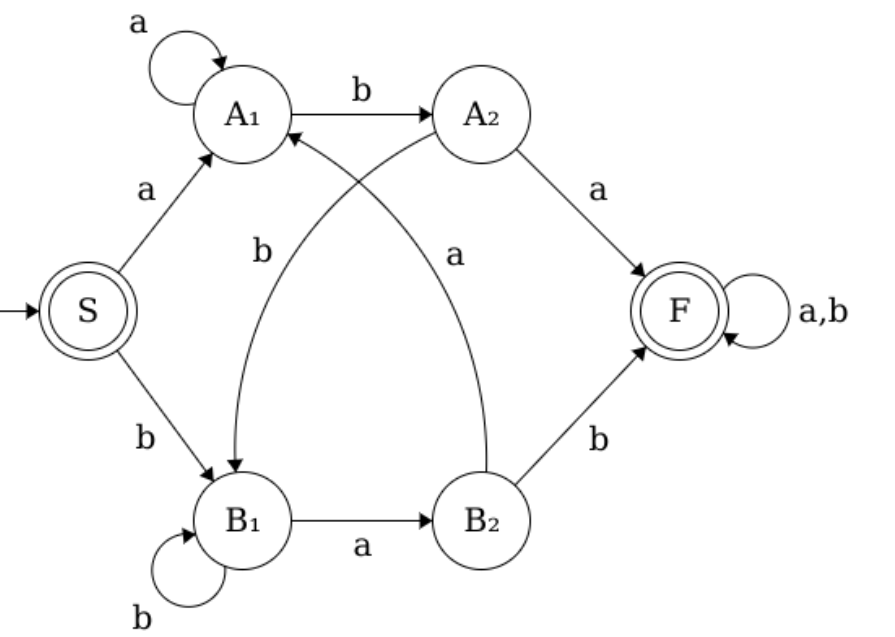
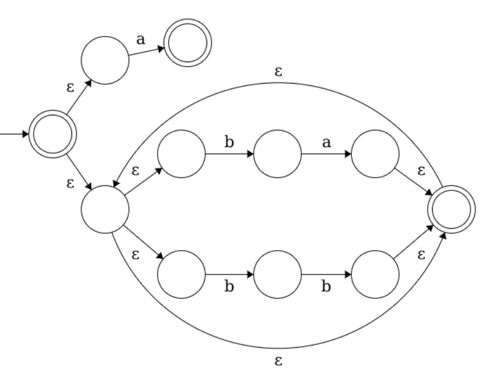
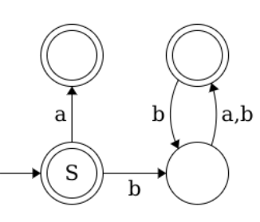
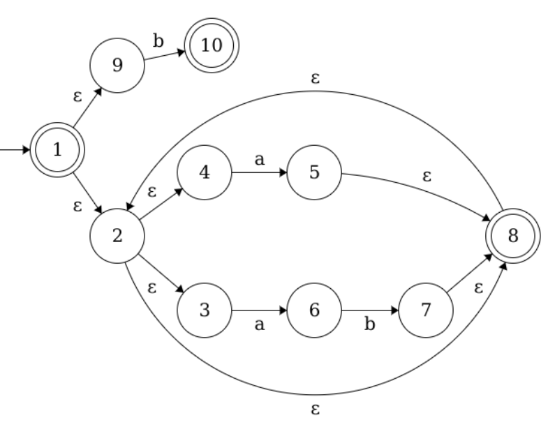
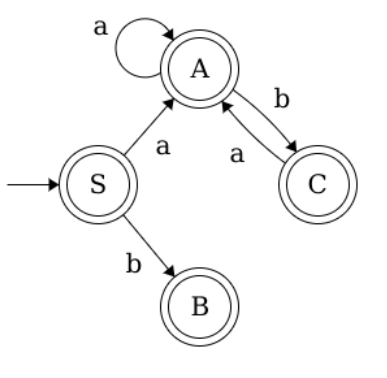

## 1

> Доказать или опровергнуть регулярность языка натуральных чисел в десятичной системе без лидирующих нулей, деляющихся на $4$ и имеющих сумму цифр, равную $2$.

Поанализируем язык:

1. Если сумма цифр равна $2$, то $\Sigma = \{ 0, 1, 2 \}$
2. Если делится на $4$ $\Rightarrow$ делится на $2$ $\Rightarrow$ последняя цифра — либо $0$, либо $2$.
    * Слово `2` не подходит, так как не делится на $4$
    * Слова вида `...2` не подходят, так как слева от двойки могут стоять только нули (чтобы не нарушить сумму = $2$), но и не может быть лидирующих нулей
    * Из этого следует, что если двойка принадлежит слову, то справа от неё стоят нули, т.е. `20+` принадлежат языку: сумма равна $2$, слева нет лидирующих нулей, делятся на 4
3. Если $2$ не в составе слова, то там находятся две единицы (чтобы не нарушить сумму = $2$).
    * Слева от $1$ нет лидирующих нулей $\Rightarrow$ слова вида `1...`
    * Слово не может быть вида `10*1`, `10*10`, потому что не делятся на $4$. Слово вида `10*10*00` делятся на $4$, потому что в конце слова два нуля.
4. Других слов нет, так как мы использовали все предикаты.

Ясно, что такой язык можно описать с помощью регулярного выражения:
`20+ | 10*100+` $\Rightarrow$ он регулярный.

## 2

> Построить регулярную грамматику, задающую язык $ L = \{ \alpha \cdot a b a \cdot \beta \mid \alpha, \beta \in \{ a, b \}^* \} \cup \{ \alpha \cdot b a b \cdot \beta \mid \alpha, \beta \in \{ a, b \}^* \} $

По сути нас интересует язык, описываемый регулярным выражением $[ab]^{* }(aba\ |\ bab)[ab]^{* }$

Построим ДКА, соответствующий языку.

Теперь осталось перевести из автомата в грамматику:

$S\ \ \to aA_1\ |\ bB_1$
$A_1 \to bA_2\ |\ aA_1$
$A_2 \to aF\ \ \,|\ bB_1$
$B_1 \to aB_2\ |\ bB_1$
$B_2 \to bF\ \ \ |\ aA_1$
$F\ \ \to a\ |\ b\ |\ aF\ |\ bF$

## 3

> Проверить регулярность языка $L = \{ 0^{|\omega|} \cdot \omega \mid \omega \in \{ 0, 1, \dots, 9 \}^* \} $

Этот язык выглядит очень подозрительно: по сути нам нужно запомнить, сколько нулей мы записали, а потом потратить эти нули на $\omega.$ Поэтому этот язык похож на контекстно-свободный, и в принципе понятно, как грамматику написать. Можно проверить по [лемме о накачке](https://ru.wikipedia.org/wiki/%D0%9B%D0%B5%D0%BC%D0%BC%D0%B0_%D0%BE_%D1%80%D0%B0%D0%B7%D1%80%D0%B0%D1%81%D1%82%D0%B0%D0%BD%D0%B8%D0%B8#%D0%9E%D0%B1%D1%80%D0%B0%D1%82%D0%BD%D0%B0%D1%8F_%D1%84%D0%BE%D1%80%D0%BC%D1%83%D0%BB%D0%B8%D1%80%D0%BE%D0%B2%D0%BA%D0%B0), но она неюзабельна вообще никак, поэтому сведём.

Известно, что язык  $(^{n }\,)^{n }$ — нерегулярный (доказывается леммой о накачке). Заметим теперь, что по сути $0^{|w|}$ отображается на $(^n$. От слова $\omega$ важна только длина этого слова, она должна совпадать с $n$, т.е. его можно отобразить на $)^n$. Содержимое $\omega$ не имеет значения. Из этих соображений следует, что язык $L$ нерегулярный, потому что если бы он был бы регулярным, то и $(^n\ )^n$ был бы регулярным (а он даже проще).

## 4

> Построить недетерминированный автомат по регулярному выражению $ a\ |\ (ba\ |\ bb)^* $, построить эпсилон-замыкание автомата

Построим $\varepsilon$-НКА согласно [теореме Клини](https://neerc.ifmo.ru/wiki/index.php?title=%D0%A2%D0%B5%D0%BE%D1%80%D0%B5%D0%BC%D0%B0_%D0%9A%D0%BB%D0%B8%D0%BD%D0%B8_(%D1%81%D0%BE%D0%B2%D0%BF%D0%B0%D0%B4%D0%B5%D0%BD%D0%B8%D0%B5_%D0%BA%D0%BB%D0%B0%D1%81%D1%81%D0%BE%D0%B2_%D0%B0%D0%B2%D1%82%D0%BE%D0%BC%D0%B0%D1%82%D0%BD%D1%8B%D1%85_%D0%B8_%D1%80%D0%B5%D0%B3%D1%83%D0%BB%D1%8F%D1%80%D0%BD%D1%8B%D1%85_%D1%8F%D0%B7%D1%8B%D0%BA%D0%BE%D0%B2)). Правда, здесь я немного ленюсь и между последовательными символами не ставлю $\varepsilon$-переходы.

Найдём $\varepsilon$-замыкание и минимизируем:

## 5

> Построить недетерминированный автомат по регулярному выражению $ (a\ |\ ab)^{* }\ |\ b $, построить эпсилон-замыкание автомата

Построим $\varepsilon$-замыкание:

## 6

Расширить язык $L$ следующими конструкциями, модифицировать лексер и описание конкретного синтаксиса
  * `**` — возведение в степень. Убедитесь, что токенизация умножения все еще работает.
  * Многострочные комментарии. Выбрать стратегию обработки вложенных многострочных комментариев.

Репозиторий обновлён: директория [task03](https://github.com/xamgore/au-fl/tree/master/task03).
