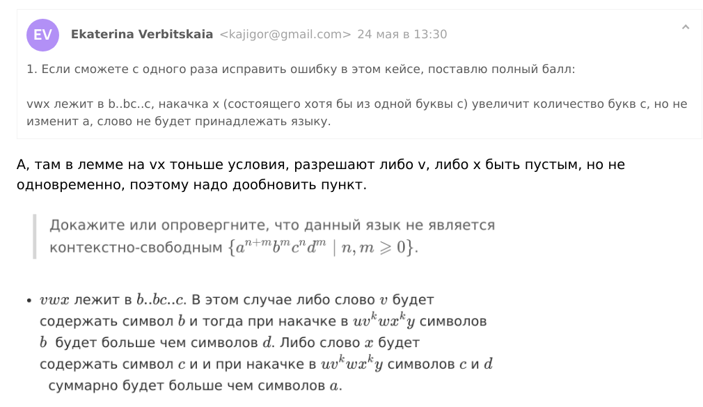

## 1

> Докажите или опровергните, что данный язык не является контекстно-свободным $\{a^{n+m}b^mc^nd^m \mid n, m \geqslant 0\}$.

По лемме о накачке докажем, что язык не контекстно-свободный. Рассмотрим слово $\omega = a^{2n} b^n c^n d^n$, любое его произвольное разбиение $uvwxy$ (где $|vwx| \leqslant n$) мы можем накачать $uv^kwx^ky$ так, чтобы оно не принадлежало языку. Паттерн матчинг по разбиению:

* $vwx$ целиком состоит из букв $a$. Накачка $v^k$ и $x^k$ увеличит количество букв $a$, что их суммарно станет больше чем $|c^nd^n| = 2n$ и слово не будет принадлежать языку.

* $vwx$ лежит на $a..ab..b \Rightarrow x \ne \varepsilon$, так как иначе бы был предыдущий случай. Накачка $x$ увеличит количество символов $b$, и суммарно их станет больше, чем букв $d$ в слове, поэтому оно не будет принадлежать языку.

* $vwx$ целиком лежит в $b..b$, накачка сделает $|b^{m+k}| > |d^m| \Rightarrow$ слово не принадлежит языку.

* $vwx$ лежит в $b..bc..c$. В этом случае либо слово $v$ будет содержать символ $b$ и тогда при накачке в $uv^kwx^ky$ символов $b$&nbsp; будет больше чем символов $d$. Либо слово $x$ будет содержать символ $c$ и и при накачке в  $uv^kwx^ky$ символов $c$ и $d$&nbsp; суммарно будет больше чем символов $a$.

* $vwx$ лежит целиком в $c..c$, аналогично предыдущему пункту.

* $vwx$ лежит в $c..cd..d$, увеличение $d$, но количество $b$ останется прежним, и слово не будет принадлежать языку.

* $vwx$ лежит целиком в $d..d$, аналогично предыдущему.

## 2

> Напишите L-атрибутную грамматику для языка арифметических выражений в инфиксной записи над натуральными числами с операциями +, −, скобками и перемеными с let-присваиваниями.

+ Результат — целое число
+ Законы арифметики должны быть соблюдены
+ Только последнее присваивание в переменную учитывается
+ На всякий случай примеры
  - “1 − (2 + 3)”→ −4
  - “let x = 13 in x + x − 24”→ 2
  - “let x = 1 in let y = 3 in let x = 7 in x − y”→ 4
  - “let x = 1 in y”→ Error
+ Промоделировать вычисления на примерах из задания

---

Ок, $env$ — набор переменных, который передаётся сверху вниз (как в $L$-атрибутных грамматиках), $val$ и $text$ — значения, которые распространяются снизу вверх (как в $S$-атрибутных грамматиках).

|Продукция|Семантические правила|Пояснение|
|---------|----------------------|--------|
| $S \to E$ | $E.env = \{\ \}$ $S.val\ = E.val$ |
| $E \to \texttt{let}\ id\ \texttt{=}\ E_l\ \texttt{in}\ E_r$ | $E_l.env = E_r.env = E.env$  $E_r.env[id] = E_l.val$  $E.val = E_r.val$ |
| $E \to T$ | $T.env = E.env$ $E.val = T.val$
| $T \to T_l \pm F_r$ | $T_l.env = F_r.env = T.env$  $T.val\ \ = T_l.val \pm F_r.val$
| $T \to F$ | $F.env = T.env$ $T.val = F.val$
| $F \to num$ | $F.val = num$ | $num$ — число |
| $F \to id$ | $F.val = F.env[id] \mathrel{?}: \texttt{Frror}$| $id$ — идентификатор переменной |
| $F \to (E)$ | $E.env = F.env$  $F.val\ \ = E.val$ |

Плюс более приоритетный, то есть `let v = e in (e + x)` а не `(let v = e in e) + x`. Но пока нельзя написать `let v = e in 2 + let v = e in 3` имея в виду `(let v = e in (2 + (let v = e in 3)))`. Я чуть позже отправлю изменённую версию, слишком поздно нашёл вот эту проблему.

* `1 - (2 + 3)`

    

* `let x = 13 in x + x − 24`
    

*  `let x = 1 in let y = 3 in let x = 7 in x − y`
    

*   `let x = 1 in y`
     
